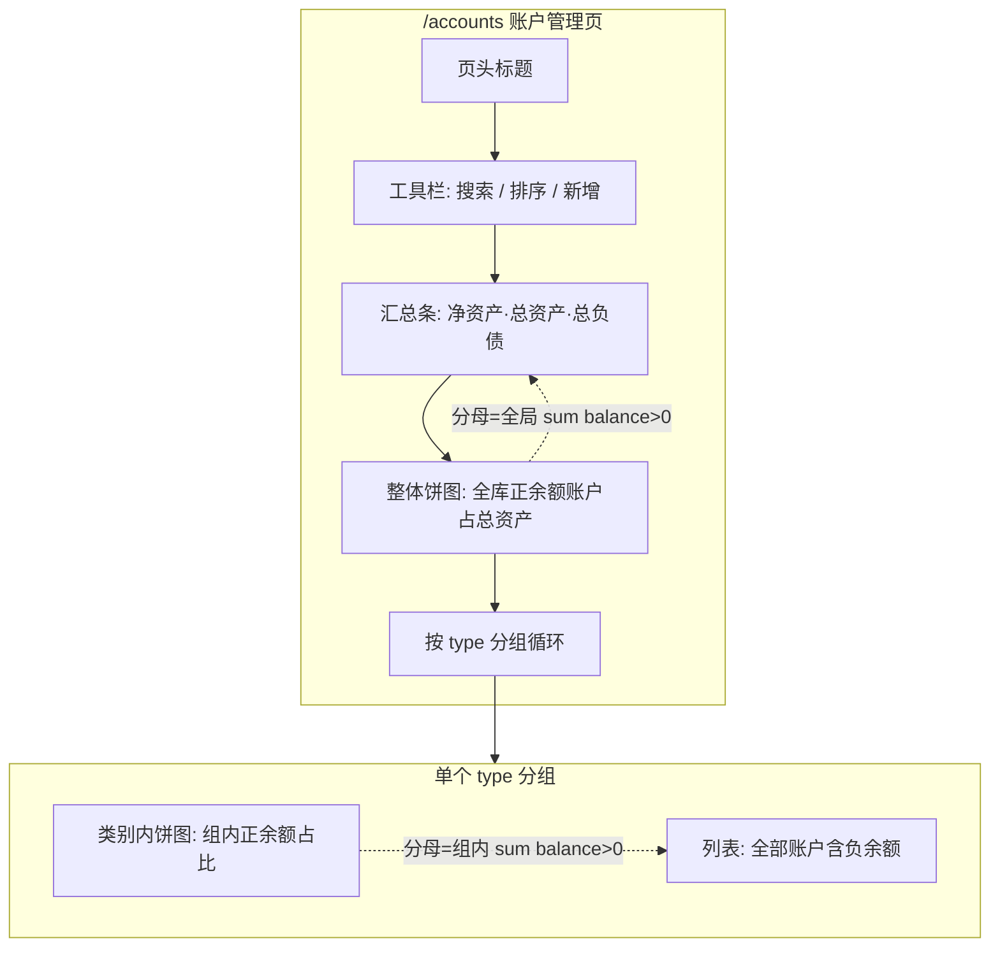

# 账户管理页面规格（桌面端）

## 0. 关联文档

| 文档 / 代码 | 说明 |
|-------------|------|
| [frontend-components.md](frontend-components.md) | 前端组件目录、数据流、`AccountManageView` 字段说明 |
| [开发计划.md](../../开发计划.md) **阶段四 · 任务 5：账户管理页面** | 独立路由 `/accounts`、列表与查询、增删改、改名策略、删除约束、**穿透至账单**（`query: { account }` / `accountId`）、与 `BillList.vue` 联动 |
| [开发计划.md](../../开发计划.md) **阶段二 · `accounts` 表** | 主数据字段：`name`、`type`（账户类别）、`note`、`sort_order` 等；与 `bills.account` 名称对齐或后续 `account_id` 迁移 |
| [add-bill-spec.md](../add-bill-spec.md) | 账单表单中账户下拉来源与 `accounts` 一致 |
| `electron-app/electron/main/database/db.ts` | 当前库表实现；若与本规格字段不一致，以实现本页所需能力为准做**增量迁移**（见第 3 节） |
| `electron-app/src/views/bill/BillList.vue` | 接收 `route.query.account`（或 `accountId`）并初始化筛选 |

---

## 1. 目标与范围

1. 提供**独立页面**（建议路由 `/accounts`，组件如 `views/accounts/AccountManage.vue`），完成账户主数据的**列表、搜索、排序、新增、编辑、删除**，以及**跳转账单列表并带上账户筛选条件**。
2. 列表按**账户类别**（`accounts.type`，如：现金、储蓄卡、信用卡、投资、其他）**分组展示**；无类别或空字符串归入 **「未分类」** 一组，组内排序默认 `sort_order` 升序，其次 `name`。
3. **整体概览饼图（全库）**：在分组列表**之上**单独一块区域，展示**所有 `balance > 0` 的账户**各自占**全局总资产**的比例（见第 5.1 节）；与汇总条中的**总资产**口径一致，便于一眼看出「钱分布在哪些账户」。
4. **每个类别分组**内仍提供一张**饼图**：展示**仅该类别内**各正余额账户占**该类别正余额合计**的比例（见第 5.2 节）。
5. **余额允许为负数**：负数表示**负债/透支**，在 UI 上与正余额区分展示；**所有饼图均不包含** `balance <= 0` 的账户，以免扭曲比例（见第 5 节）。
6. 汇总条中的**净资产**（全账户余额代数和）与饼图分母**总资产**（仅正余额之和）不同：饼图回答「正资产怎么分」；净资产回答「扣掉负债后还剩多少」——二者需在 UI 文案或 tooltip 中区分（见第 5.1 节）。

---

## 2. 信息架构与页面结构

### 2.1 页面分区（自上而下）

| 区域 | 职责 |
|------|------|
| **页头** | 标题「账户管理」；可选说明文案（一行）：负债以负数余额展示；饼图仅统计正余额，**整体饼图**的分母为总资产，与净资产不同。 |
| **工具栏** | 关键字搜索（名称、备注）；排序切换（按名称 / 按余额 / 按排序号，升序默认）；**新增账户**主按钮。 |
| **汇总条（可选但推荐）** | 只读指标：**净资产** = 所有账户 `balance` 之和；**总资产** = `balance > 0` 之和；**总负债** = `balance < 0` 之和的绝对值（或带负号展示，二选一但全站统一）。 |
| **整体概览** | **一张全局饼图**（建议标题：「正余额账户占**总资产**分布」）：跨全部类别，扇区为各正余额账户，分母 = 汇总条「总资产」（见第 5.1 节）；无正余额账户时占位文案。宽屏可与右侧简短说明或迷你图例并排。 |
| **主体** | 按 `type` 分组的 **折叠面板 `el-collapse`** 或 **垂直排列的 `el-card` 区块**；每组内 **左侧或上方饼图 + 下方/右侧账户列表**（见线框图）。 |

### 2.2 界面线框图（结构示意）

下列图为**布局与信息层级**示意，非视觉稿；具体间距、色板与 Element Plus 主题一致。

#### 2.2.1 整页布局（宽屏）

```text
+----------------------------------------------------------------------------------+
|  [← 返回/侧栏已选]  账户管理                                                        |
+----------------------------------------------------------------------------------+
| [ 搜索名称/备注___________ ]  [排序: 名称|余额|排序号 ▼]  [ + 新增账户 ]          |
+----------------------------------------------------------------------------------+
| 净资产 ¥xx,xxx.xx   |   总资产 ¥xx,xxx.xx   |   总负债 ¥xx,xxx.xx          |
+----------------------------------------------------------------------------------+
| 「整体」正余额占总资产分布  [ 饼图：全部 balance>0 账户，分母=总资产，与上栏一致 ]   |
| （无正余额时：「暂无正余额资产」；副标题/tooltip：净资产含负债，与本图分母不同）      |
+----------------------------------------------------------------------------------+
| ▼ 现金                                                                            |
|   +---------------------------+  +----------------------------------------------+  |
|   |     [ 饼图 ECharts ]       |  | 账户名      余额        操作                  |  |
|   |  仅正余额账户占比         |  | 钱包        ¥1,200      编辑 | 账单 | 删除    |  |
|   |  图例：账户名 + 占比%     |  | ...                                         |  |
|   +---------------------------+  +----------------------------------------------+  |
|   （若该组无正余额账户：饼图区显示占位文案「暂无正余额资产」）                      |
+----------------------------------------------------------------------------------+
| ▼ 储蓄卡                                                                          |
|   （同上：饼图 + 表格/卡片列表）                                                    |
+----------------------------------------------------------------------------------+
| ▼ 信用卡（示例：多为负债）                                                        |
|   饼图：若无正余额 → 占位；列表：红色负号或标签「负债」                              |
+----------------------------------------------------------------------------------+
| ▼ 未分类                                                                          |
+----------------------------------------------------------------------------------+
```

#### 2.2.2 单类别区块（组件级）

```text
+--- 类别标题（type 显示名 + 组内账户数） ----------------------------------------+
|                                                                                  |
|   +----------------------+    +----------------------------------------------+ |
|   |                      |    | [表格 el-table 或紧凑卡片列表]                | |
|   |   PieChart           |    | 列：图标 名称 余额 备注 排序号 操作            | |
|   |   height ~ 220px     |    | 行点击 / 「查看账单」→ /bills?account=...     | |
|   |                      |    +----------------------------------------------+ |
|   +----------------------+                                                        |
|   窄屏时：饼图在上，表格在下（单列堆叠）                                            |
+----------------------------------------------------------------------------------+
```

### 2.3 布局流程图（Mermaid）



---

## 3. 数据字段与迁移说明

### 3.1 与《开发计划》示例表对齐的字段

| 字段 | 说明 |
|------|------|
| `name` | 必填，唯一 |
| `type` | 账户类别，用于分组与多饼图维度；枚举或自由文本由产品定，建议预设：现金、储蓄卡、信用卡、投资、其他 |
| `note` | 备注 |
| `sort_order` | 组内排序 |
| `balance` | 当前余额，**允许负数**；可与账单流水联动更新（若当前为手动维护，规格仍允许录入负数） |
| `icon` | 可选 |
| `currency` | 可选，默认 CNY；多币种时饼图需按组内统一币种或分开展示（V2） |

当前代码中 `Account` 接口与 `db.ts` 若缺少 `type` / `note` / `sort_order`，实现本页前应**增量迁移**补列，并同步 TypeScript 类型；不改变《开发计划》中「名称与账单关联」的约定。

### 3.2 负数余额语义

- **业务含义**：信用卡欠款、借款账户、透支等，统一用**负数 `balance`** 表示。
- **展示**：表格中余额列右对齐，负数可用主题危险色或前缀 `-`；可加 `el-tag`「负债」仅当 `balance < 0`（可选）。
- **校验**：保存时**允许** `balance < 0`；不要求与饼图数据一致（饼图独立按第 5 节过滤）。

---

## 4. 功能细则

### 4.1 列表与查询

- **搜索**：对 `name`、`note` 做包含匹配（不区分大小写可选）；过滤后仍保持分组结构，**隐藏无匹配账户的空分组**。
- **排序**（组内或与全局一致，推荐组内）：
  - 按排序号：`sort_order` ASC，`name` ASC；
  - 按名称：`name` ASC；
  - 按余额：`balance` DESC（资产优先）或 ASC（产品二选一，默认 DESC 便于看最大账户）。
- **展示形态**：优先 `el-table`（桌面信息密度高）；若将来要卡片式，保持同一数据源与操作列。

### 4.2 新增 / 编辑

- **表单字段**：名称（必填）、类别 `type`（`el-select` 可带「自定义」或从字典表读取）、余额（`el-input-number`，允许负）、备注、排序号、图标（可选）。
- **唯一性**：`name` 提交前主进程或 IPC 校验唯一；冲突时表单项错误提示。
- **改名**（与开发计划一致）：若账单仍用 `bills.account` 存名称，改名时 **Modal 警告**：历史账单中的账户名字符串不会自动变更；提供「仍要保存」或产品侧「禁止改名 / 批量替换脚本」二选一，**在实现时与 add-bill 策略统一**。

### 4.3 删除

- 二次确认 `ElMessageBox`。
- 若存在关联账单：与数据库约定一致——**禁止删除**或**级联策略**；禁止时提示「请先解除账单关联或迁移账户」。

### 4.4 穿透至账单

- 行内操作 **「查看账单」** 或**整行点击**（二选一避免误触；若整行点击，操作列按钮需 `stop` 冒泡）：
  - `router.push({ path: '/bills', query: { account: encodeURIComponent(name) } })`
  - 若已迁移 `accountId`：`query: { accountId: String(id) }`
- `BillList.vue`：在 `onMounted` / `watch(() => route.query)` 中读取并应用筛选（与开发计划一致）。

---

## 5. 饼图（ECharts）规格

### 5.1 整体概览饼图（跨全部类别）

**目的**：展示**每一个正余额账户**在**全库总资产**中的占比，与汇总条「总资产」数字同源，便于和「净资产」对照理解。

定义：

- **总资产（饼图分母）** `G` = 所有账户中 `balance > 0` 的部分相加（与 §2.1 汇总条「总资产」一致）。
- **净资产** `N` = 所有账户 `balance` 代数和（含负数），**不作为**本饼图分母；存在负债时通常 `N < G`，用净资产作分母既不能与「各正余额账户占比之和 = 100%」对齐，也可能出现非正分母，故本图固定以 **总资产 `G`** 为分母。

规则：

1. 令 `P_all = { 全表 balance > 0 的账户 }`。
2. 若 `P_all` 为空：**不绘制饼图**，展示占位：「暂无正余额资产」。
3. 若 `P_all` 非空：
   - 扇区 **名称** = `account.name`（可附 `type` 于 tooltip 便于辨认）
   - 扇区 **数值** = `balance`
   - **占比** = `balance / G`，tooltip 显示金额 + 百分比（保留 1 位小数）
4. **`balance <= 0` 的账户不出现在整体饼图中**；建议在整体图下方一行小字：「负债账户未计入；**净资产**见上方汇总（= 各账户余额代数和）。」

### 5.2 数据口径（按类别独立计算）

对每个分组 `type = T`：

1. 取该组内所有账户，令 `P = { balance > 0 的账户 }`。
2. 若 `P` 为空：**不绘制饼图**，展示占位：「该类别下暂无正余额账户」。
3. 若 `P` 非空：
   - 扇区 **名称** = `account.name`
   - 扇区 **数值** = `balance`（正数）
   - **占比** = `balance / sum(P.balance)`（**仅相对本类别正余额合计**，与 §5.1 的全局占比不同）
4. **`balance <= 0` 的账户不出现在饼图中**；在下方表格中照常列出，并在表格上方可加一行说明：「以下负债账户未计入上图资产占比」。

### 5.3 交互与可读性

- **图例**：可点击切换显示；账户过多时（如 >8）考虑合并为「其他」或仅显示 Top N + 其他（V2）。
- **颜色**：使用 Element Plus / ECharts 调色板，**负债行不使用饼图颜色映射**，避免误解。
- **空分组**：无账户的类别不渲染分组（或渲染折叠空状态）。

### 5.4 与阶段五统计页的关系

- 本页 **§5.1** 表达「**全局**正余额账户占总资产分布」；**§5.2** 表达「**各类别内**正余额账户的相对占比」。统计页可再做时间维度、收支结构等；实现时可复用项目内已有 ECharts 封装（参见 [开发计划.md](../../开发计划.md) 阶段五）。

---

## 6. 响应式与无障碍

- **窄窗口**：整体饼图与类别内饼图、表格**垂直堆叠**；饼图高度可略减（如整体 240px、类别内 180px）。
- **键盘**：表格行焦点、操作按钮可 Tab 聚焦；对话框内焦点陷阱符合 Element Plus 默认行为。

---

## 7. 验收要点（摘要）

- [ ] `/accounts` 可打开；搜索、排序、增删改可用，`name` 唯一。
- [ ] 按 `type` 分组展示正确；「未分类」覆盖 `type` 为空。
- [ ] **整体饼图**存在，且扇区为**全库** `balance > 0` 账户，分母等于汇总条**总资产**；无正余额时占位。
- [ ] 每个分组一张**类别内**饼图，且**仅包含该组 `balance > 0` 账户**；负余额仅在列表展示。
- [ ] 汇总条（若实现）净资产 = 全表 `balance` 之和；总资产 = 全表正余额之和，与整体饼图分母一致。
- [ ] 跳转 `/bills?account=...`（或 `accountId`）后列表筛选正确。

---

## 8. 修订记录

| 日期 | 说明 |
|------|------|
| 2026-03-21 | 初稿：对齐开发计划任务 5；分类展示 + 按类饼图（排除负余额）；线框与 Mermaid 结构图 |
| 2026-03-21 | 增加**整体饼图**：全库正余额账户占**总资产**分布；区分净资产与总资产口径 |
