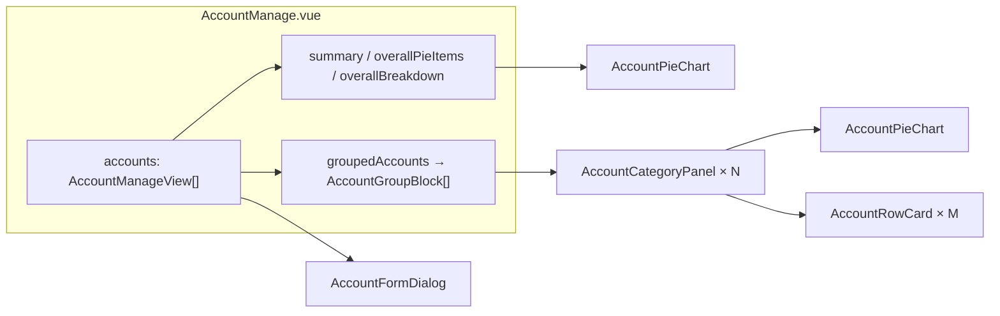

# 账户管理前端：组件组织与数据说明

本文说明 `electron-app/src/views/accounts` 下页面的**文件布局、组件分工、需要填入的数据**，并与 [accounts-manage-spec.md](accounts-manage-spec.md)、[accounts-manage-ui-improvements.md](accounts-manage-ui-improvements.md) 交叉引用。拆分约定见 [vue-page-component-conventions.md](vue-page-component-conventions.md)。

---

## 1. 目录结构

```text
views/accounts/
├── AccountManage.vue          # 路由页面：编排布局、聚合数据、路由跳转
├── types.ts                   # re-export AccountManageView；AccountGroupBlock、排序模式、类别预设
├── accountStorage.ts          # localStorage 读写与「恢复演示数据」
├── initialAccounts.ts         # 演示用初始账户列表
├── utils/
│   └── formatMoney.ts         # 金额展示格式化
└── components/
    ├── AccountFormDialog.vue  # 新增/编辑弹窗、校验、写回 accounts 列表
    ├── AccountCategoryPanel.vue  # 单个类别卡片：饼图区 + 账户卡片列表
    ├── AccountRowCard.vue     # 单账户卡片（名称链接、余额、操作按钮）
    └── AccountPieChart.vue    # ECharts 环形图（整体与分类内复用）
```

当前实现**未接 SQLite/IPC**：账户列表来自 `loadAccounts()`，变更经 `watch(accounts)` 调用 `saveAccounts` 写入 `localStorage`（key：`local-ledger:accounts-manage-demo`）。接入后端后，应把「加载/保存」替换为与 `accounts` 表一致的接口，**行结构仍可对齐 `AccountManageView`**（定义在 `shared/domain/dto.ts`）。

---

## 2. 组件职责与数据流



| 模块 | 职责 |
|------|------|
| **AccountManage.vue** | 页头、工具栏（搜索、组内排序、新增）、汇总条（净资产/总资产/总负债）、整体分布卡片（饼图 + 「各账户占比」表）、按类别两列矩阵渲染 `AccountCategoryPanel`；`goBills` → `/bills?account=...`；删除确认后过滤列表。 |
| **AccountFormDialog.vue** | `v-model:visible`、`v-model:accounts`、`v-model:nextId`；`openCreate` / `openEdit`（`defineExpose`）；表单字段与改名警告（与账单按名称关联时的策略一致，见规格 §4.2）。 |
| **AccountCategoryPanel.vue** | 接收聚合后的 `AccountGroupBlock`：`pieItems` 仅含 `balance > 0`；`<=1` 个正余额账户时不画饼图而用占位/提示；内嵌 `AccountRowCard` 列表。 |
| **AccountRowCard.vue** | 展示单条 `AccountManageView`；名称与「查看账单」触发 `go-bills`；编辑/删除上抛给面板再传到页面。 |
| **AccountPieChart.vue** | 纯展示：`items: { name, value }[]`、`height`、`density`（分类内两扇区时用 `compact`）。 |

页面层**计算属性**要点（与规格对齐）：

- **分组**：`type` 去空格后为空则归入标签「未分类」；组顺序优先按预设 `现金 → … → 未分类`，其余按中文排序。
- **组内排序**：由 `sortMode` 控制 `sort_order` / `name` / `balance_desc`。
- **AccountGroupBlock**：含 `items`（该组全部账户）、`pieItems`（仅正余额）、`hasNegative`、`groupNet`（该组余额代数和，用于卡片头展示）。
- **汇总与整体饼图**：`summary` 与 `overallPieItems` 均基于**全表** `accounts`（搜索只影响分组列表，汇总与整体图当前仍用全量账户；若产品要求「筛选后联动汇总」，需在规格中另定口径后再改代码）。

---

## 3. 需要填入的数据（`AccountManageView`）

与 [accounts-manage-spec.md §3](accounts-manage-spec.md) 一致，**跨边界类型**定义在 `electron-app/shared/domain/dto.ts`，`types.ts` 仅 re-export 供本页 import。

| 字段 | 类型 | 必填 | 说明 |
|------|------|------|------|
| `id` | `number` | 是 | 本地唯一主键；新增时由 `nextId` 递增分配。 |
| `name` | `string` | 是 | 展示名；跳转账单时使用 `encodeURIComponent(name)`，需与账单侧筛选字段一致。 |
| `type` | `string` | 否 | 类别；空字符串视为「未分类」。预设见 `ACCOUNT_TYPE_PRESETS`，表单支持自定义输入。 |
| `note` | `string` | 否 | 备注；参与关键字搜索。 |
| `sort_order` | `number` | 是 | 组内排序，默认与名称二级排序共用。 |
| `balance` | `number` | 是 | **允许负数**表示负债；饼图仅纳入 `balance > 0`。 |
| `icon` | `string \| null` | 否 | 类型已预留，当前 UI 未强依赖。 |

**演示/种子数据**：`initialAccounts.ts` 中提供正负余额、多类别、未分类示例；「恢复演示数据」会重置为该项并写回存储。

**接入数据库时**：保证 `name` 唯一、删除前关联账单校验等，按规格 §4.3 与后端约定实现；饼图与汇总口径仍以规格 **§5** 为准。

---

## 4. 与 UI 改进文档的对应关系

[accounts-manage-ui-improvements.md](accounts-manage-ui-improvements.md) 记录布局滚动（`Layout.vue` 与 `min-height:0`）、汇总条样式、整体区右栏改为占比表、分类内少扇区不画图、名称链接触达账单等。**§1 总览表**可直接对照当前代码是否已全部落地。

---

## 5. 修订记录

| 日期 | 说明 |
|------|------|
| 2026-03-22 | 初稿：组件组织、数据字段、与 spec/UI 文档索引 |
